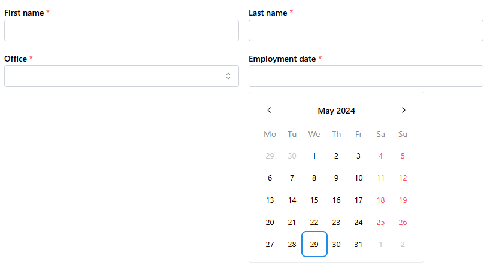
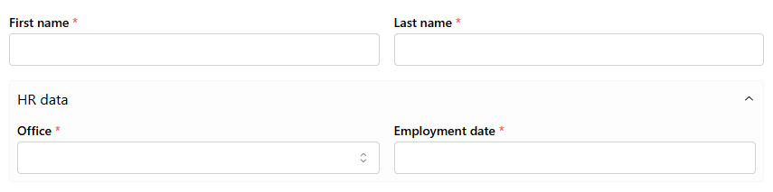
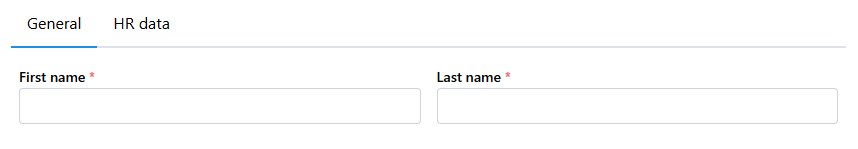
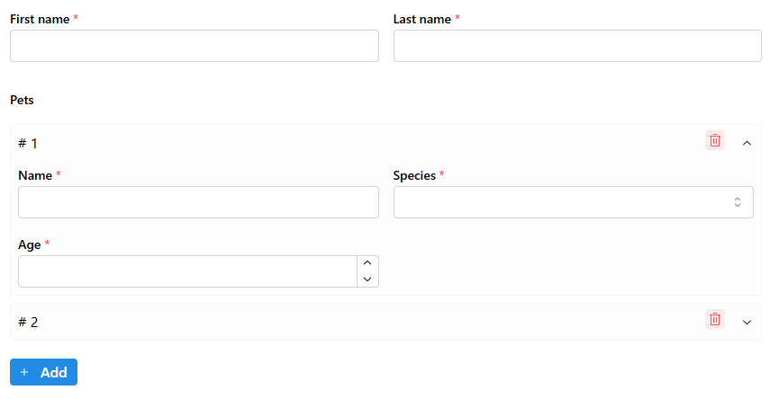
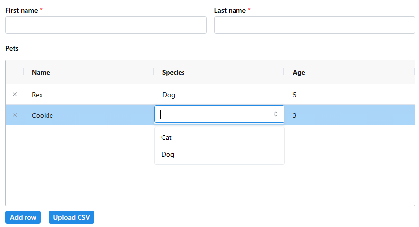
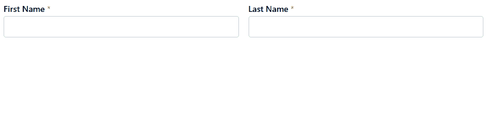
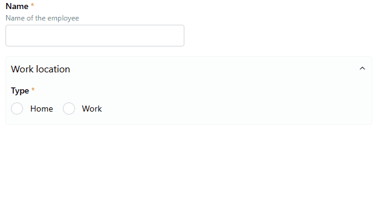

# Dash pydantic form

This package allows users to quickly create forms with Plotly Dash based on pydantic models.

See the full docs at [dash-pydantic-form docs](https://pydf-docs.onrender.com).

Check out a full self-standing example app in [usage.py](usage.py).

## Getting started

Install with pip

```sh
pip install dash-pydantic-form
```

Create a pydantic model you would like to display a form for.

*Note: This package uses pydantic 2.*

```py
from datetime import date
from typing import Literal
from pydantic import BaseModel, Field

class Employee(BaseModel):
    first_name: str = Field(title="First name")
    last_name: str = Field(title="Last name")
    office: Literal["au", "uk", "us", "fr"] = Field(title="Office")
    joined: date = Field(title="Employment date")
```

Then you can get an auto-generated form with `ModelForm`, leveraging [dash-mantine-components](https://dash-mantine-components.com) (version 0.14) for form inputs.

```py
from dash_pydantic_form import ModelForm

# somewhere in your layout:
form = ModelForm(
    Employee,
    aio_id="employees",
    form_id="new_employee",
)
```



You can also render a pre-filled form by passing an instance of the data model rather than the class

```py
# NOTE: This could come from a database
bob = Employee(first_name="Bob", last_name="K", office="au", joined="2020-05-20")

form = ModelForm(
    bob,
    aio_id="employees",
    form_id="bob",
)
```

You can then retrieve the contents of the whole form at once in a callback as follows

```py
from dash import Input, Output, callback

@callback(
    Output("some-output-id", "some-output-attribute"),
    Input(ModelForm.ids.main("employees", "new_employee"), "data"),
)
def use_form_data(form_data: dict):
    try:
        print(Employee(**form_data))
    except ValidationError as exc:
        print("Could not validate form data:")
        print(exc.errors())
    return # ...
```

## Customising inputs

The `ModelForm` will automaticlly pick which input type to use based on the type annotation for the model field. However, you can customise how each field input is rendered, and or pass additional props to the DMC component.

```py
from dash_pydantic_form import ModelfForm, fields

form = ModelForm(
    Employee,
    aio_id="employees",
    form_id="new_employee",
    fields_repr={
        # Change the default from a Select to Radio items
        # NOTE: `description` can be set on pydantic fields as well
        "office": fields.RadioItems(description="Wich country office?"),
        # Pass additional props to the default input field
        "joined": {"maxDate": "2024-01-01"},
    },
)
```

You can also customise inputs by adding arguments to the fields' json_schema_extra if you don't mind mixing data and presentation layers.

```py
class Employee(BaseModel):
    first_name: str = Field(title="First name")
    last_name: str = Field(title="Last name")
    office: Literal["au", "uk", "us", "fr"] = Field(
        title="Office",
        description="Wich country office?",
        # Use repr_type to change the default field used
        json_schema_extra={"repr_type": "RadioItems"},
    )
    joined: date = Field(
        title="Employment date",
        # Use repr_kwargs to pass default keyword arguments to the field
        json_schema_extra={"repr_kwargs": {"maxDate": "2024-01-01"}},
    )

form = ModelForm(Employee, aio_id="employees", form_id="new_employee")
```

Note: You can currently skip the `json_schema_extra=...` and just pass `repr_type=..., repr_kwargs=...` in the field. However, the `**extras` keyword arguments are deprecated on pydantic's `Field` so using `json_schema_extra` is more future-proof.

### List of current field inputs:

Based on DMC:
* Checkbox
* Checklist
* Color
* Date
* Json
* Month
* MultiSelect
* Number
* Password
* RadioItems
* Range
* Rating
* SegmentedControl
* Select
* Slider
* Switch
* Tags
* Textarea
* Text
* Time
* Year

Custom:
* Dict
* Table
* List
* Markdown
* Model
* Path
* Quantity
* TransferList

## Creating sections

There are 2 main avenues to create form sections:

### 1. Create a submodel in one of the model fields

```py
class HRData(BaseModel):
    office: Literal["au", "uk", "us", "fr"] = Field(title="Office")
    joined: date = Field(title="Employment date")

class EmployeeNested(BaseModel):
    first_name: str = Field(title="First name")
    last_name: str = Field(title="Last name")
    hr_data: HRData = Field(title="HR data")
```
ModelForm will then recognise HRData as a pydantic model and use the `fields.Model` to render it, de facto creating a section.



### 2. Pass sections information to ModelForm

```py
from dash_pydantic_form import FormSection, ModelForm, Sections

form = ModelForm(
    Employee,
    aio_id="employees",
    form_id="new_employee",
    sections=Sections(
        sections=[
            FormSection(name="General", fields=["first_name", "last_name"], default_open=True),
            FormSection(name="HR data", fields=["office", "joined"], default_open=False),
        ],
        # 3 render values are available: accordion, tabs and steps
        render="tabs",
    ),
)
```



## List of nested models

Dash pydantic form also handles lists of nested models with the possibility to add/remove items from the list and edit each one.

Let's say we now want to record the employee's pets

### 1. List

This creates a list of sub-forms each of which can take similar arguments as a ModelForm (fields_repr, sections).

```py
class Pet(BaseModel):
    name: str = Field(title="Name")
    species: Literal["cat", "dog"] = Field(title="Species")
    age: int = Field(title="Age")

class Employee(BaseModel):
    first_name: str = Field(title="First name")
    last_name: str = Field(title="Last name")
    pets: list[Pet] = Field(title="Pets", default_factory=list)

form = ModelForm(
    Employee,
    aio_id="employees",
    form_id="new_employee",
    fields_repr={
        "pets": fields.List(
            fields_repr={
                "species": {"options_labels": {"cat": "Cat", "dog": "Dog"}}
            },
            # 3 render_type options: accordion, list or modal
            render_type="accordion",
        )
    },
)
```



### 2. Table

You can also represent the list of sub-models as an ag-grid table with `fields.Table`.

```py
form = ModelForm(
    Employee,
    aio_id="employees",
    form_id="new_employee",
    fields_repr={
        "pets": fields.Table(
            fields_repr={
                "species": {"options_labels": {"cat": "Cat", "dog": "Dog"}}
            },
        )
    },
)
```




## Make fields conditionnally visible

You can make field visibility depend on the value of other fields in the form. To do so, simply pass a `visible` argument to the field.

```py
class Employee(BaseModel):
    first_name: str
    last_name: str
    only_bob: str | None = Field(
        title="Only for Bobs",
        description="What's your favourite thing about being a Bob?",
        default=None,
    )

form = ModelForm(
    Employee,
    aio_id="employees",
    form_id="new_employee",
    fields_repr={
        "only_bob": fields.Textarea(
            visible=("first_name", "==", "Bob"),
        )
    },
)
```



`visible` accepts a boolean, a 3-tuple or list of 3-tuples with format: (field, operator, value). The available operators are:
* "=="
* "!="
* "in"
* "not in"
* "array_contains"
* "array_contains_any"

NOTE: The field in the 3-tuples is a ":" separated path relative to the current field's level of nesting. If you need to reference a field from a parent or the root use the special values `_parent_` or `_root_`.

E.g., `visible=("_root_:first_name", "==", "Bob")`

## Discriminated unions

Dash pydantic form supports Pydantic [discriminated unions with str discriminator](https://docs.pydantic.dev/latest/concepts/unions/#discriminated-unions-with-str-discriminators)

```py
class HomeOffice(BaseModel):
    """Home office model."""

    type: Literal["home_office"]
    has_workstation: bool = Field(title="Has workstation", description="Does the employee have a suitable workstation")


class WorkOffice(BaseModel):
    """Work office model."""

    type: Literal["work_office"]
    commute_time: int = Field(title="Commute time", description="Commute time in minutes", ge=0)

class Employee(BaseModel):
    name: str = Field(title="Name")
    work_location: HomeOffice | WorkOffice | None = Field("Work location", default=None, discriminator="type")

form = ModelForm(
    Employee,
    aio_id="employees",
    form_id="new_employee",
    fields_repr={
        "work_location": {
            "fields_repr": {
                "type": fields.RadioItems(
                    options_labels={"home_office": "Home", "work_office": "Work"}
                )
            },
        },
    }
)
```



## Creating custom fields

*To be written*

## Custom Model Lookup

In some advanced use-cases, you might need to customize how model classes are resolved—such as when restoring forms from serialized state, using dynamic imports, or working with model registries.
You can now provide your own model-finding logic via the `register_model_retrieval` dictionary in `dash_pydantic_utils`.

**How to use:**

```python
from dash_pydantic_utils import register_model_retrieval

def my_custom_model_finder(model_identifier: str):
    # Implement your logic to return the appropriate model class
    # For example, use a registry, dynamic import, etc.
    ...

register_model_retrieval(my_custom_model_finder)
```

Once set, `dash-pydantic-form` will invoke your function whenever it needs to resolve a model class from an identifier (such as when restoring a form from serialized state).

**Your function should return a valid Pydantic model class, or None if not found.**

Need more examples? [See the pull request introducing this feature.](https://github.com/RenaudLN/dash-pydantic-form/pull/130)

## Dirty Field Tracking

This package tracks which fields have been changed (“dirty fields”) in your form. When a field value is updated, its path is recorded—allowing you to identify and submit only changed data.

### What’s Tracked

- **Changed fields:** Any field whose value is edited.
- **Nested fields:** Changes in nested objects or arrays are tracked by their full path (e.g., `items.2.price`).

### What’s NOT Tracked

- **Deletions or removals:** If you remove an item from a list/array, this is not explicitly tracked. Only fields that are changed remain in the dirty field record.
- **Index shifting:** If you remove an item from an array, the indices of subsequent items are not updated in the dirty field record.

### Example

If you change `user.name` and `items.2.price`, the dirty tracker will report that the following fields are dirty:
```json
{
  "user.name": 1,
  "items.2.price": 1
}
```

If you remove `items.2`, removals are not tracked—only changed fields are reported.

### Rationale

This simple approach keeps the package lightweight and covers most use cases for partial form updates. For advanced change tracking (deletions, index shifts, etc.), consider post-processing dirty fields or handling these scenarios in your backend.

---

**Limitations:**  
Dirty tracking does not record deleted fields or index changes. If your workflow requires tracking removals, handle this logic outside the package.

## Contributing

This project uses [pixi](https://pixi.sh/latest/) to manage the environment. Install the pixi cli with

```sh
curl -fsSL https://pixi.sh/install.sh | bash
```

Then install the environment with

```sh
pixi install
```
